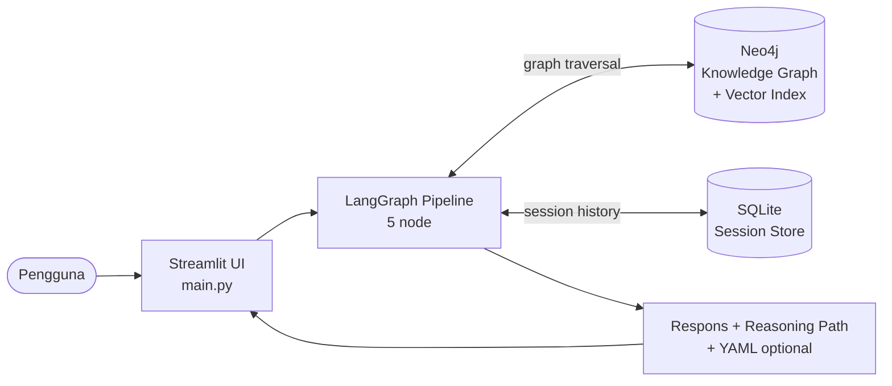
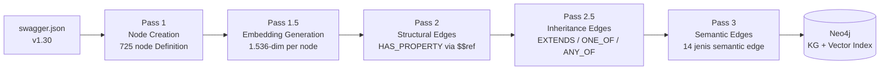
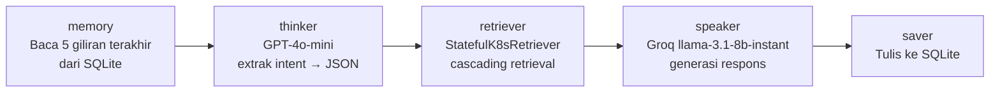
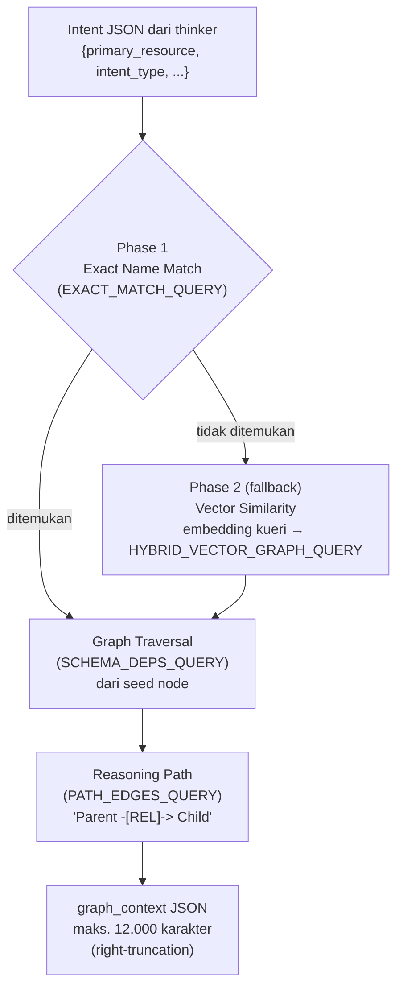
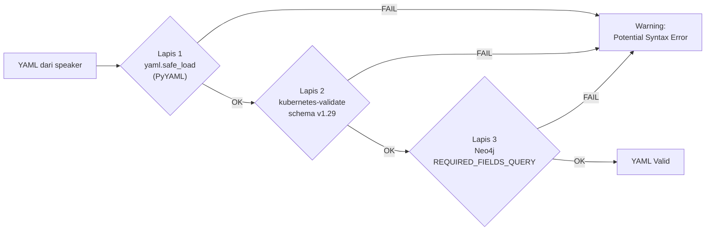

# Konteks TA: Implementasi GraphRAG untuk Konfigurasi Kubernetes

---

## Bagian 1 — Metadata TA

| Atribut | Nilai |
|---------|-------|
| **Judul** | Implementasi *Graph Retrieval Augmented Generation* untuk Meningkatkan Presisi *Retrieval* dan Validitas Sintaksis pada Konfigurasi Kubernetes |
| **Penulis** | Jihan Aurelia (18222001) |
| **Program Studi** | Sistem dan Teknologi Informasi |
| **Institusi** | Sekolah Teknik Elektro dan Informatika, Institut Teknologi Bandung |
| **Pembimbing** | Dr. Ir. Dimitri Mahayana, M.Eng. |
| **Tahun** | 2025 |

---

## Bagian 2 — Ringkasan Eksekutif

LLM berbasis *vector RAG* gagal menghasilkan konfigurasi Kubernetes yang valid karena tidak memahami relasi hierarkis dan referensial antar-objek skema (hanya mencapai 63,4% *exact match accuracy* dan 69,8% *context precision*). Penelitian ini membangun sistem *Graph Retrieval-Augmented Generation* (GraphRAG) yang mengonversi spesifikasi OpenAPI Kubernetes (`swagger.json` v1.30) menjadi *knowledge graph* Neo4j (725 *node*, 18 jenis *edge*), lalu menggunakannya sebagai basis *retrieval* bertingkat berbasis traversal graf. Sistem diimplementasikan sebagai pipeline LangGraph 5-*node* dengan arsitektur dual-LLM: GPT-4o-mini sebagai *Thinker* (ekstraksi *intent*) dan Groq *llama-3.1-8b-instant* sebagai *Speaker* (generasi respons). Evaluasi terhadap 97 *fixture* menunjukkan GraphRAG mencapai skor komposit **0,6769**, mengungguli *Vector RAG* (0,6161) dan *Vanilla LLM* (0,3894), dengan validitas sintaksis YAML sempurna (**1,0000**) berkat validasi tiga lapis berbasis *knowledge graph*.

---

## Bagian 3 — Rumusan Masalah, Tujuan, dan Batasan

### 3.1 Peta Navigasi RQ → Tujuan → Bagian

| RQ | Rumusan Masalah | Tujuan | Dijawab di |
|----|-----------------|--------|-----------|
| **RQ1** | Bagaimana membangun *knowledge graph* dari spesifikasi Kubernetes yang merepresentasikan struktur dan relasi antar-objek secara komprehensif? | Membangun KG dari `swagger.json` v1.30 melalui *pipeline* ekstraksi; memetakan 725 objek dan 18 jenis relasi | Bagian 5 |
| **RQ2** | Bagaimana merancang mekanisme GraphRAG berbasis KG untuk meningkatkan presisi *retrieval* pada konfigurasi Kubernetes? | Mengembangkan *cascading retrieval* dengan *graph traversal*; menginjeksikan *reasoning path* ke LLM | Bagian 6–8 |
| **RQ3** | Bagaimana perbandingan kinerja GraphRAG vs. *Vector RAG* vs. *Vanilla LLM* pada presisi *retrieval* dan validitas sintaksis konfigurasi Kubernetes? | Mengevaluasi tiga dimensi (AnsQ, RetQ, ReaQ) pada 97 *fixture*; membandingkan tiga sistem | Bagian 9 |

### 3.2 Batasan Masalah

- Data eksklusif dari blok `definitions` `swagger.json` Kubernetes v1.30 (tidak termasuk *paths*, *parameters*, *responses*)
- KG merepresentasikan *schema structure* saja, bukan *runtime behavior*
- Output: manifes YAML polos + *reasoning path* (tidak diuji di klaster nyata)
- LLM: GPT-4o-mini dan Groq *llama-3.1-8b-instant* tanpa *fine-tuning*
- Kedalaman traversal graf maksimal 3 lompatan (*hops*)
- *Processing*: Google Colab + Jupyter Notebook
- *Hardware*: AMD Ryzen 5, AMD Radeon RX 6750XT, RAM 16 GB

---

## Bagian 4 — Arsitektur Sistem

### Diagram 1: Arsitektur Keseluruhan



*Setiap permintaan pengguna diproses melalui pipeline LangGraph yang mengambil konteks dari Neo4j (Knowledge Graph dan vector index) dan riwayat dari SQLite, lalu mengembalikan respons beserta jejak penalaran graf.*

### Komponen Utama

| Komponen | Teknologi | Peran |
|----------|-----------|-------|
| Frontend | Streamlit (`main.py`) | Antarmuka percakapan berbasis web; UUID unik per sesi |
| Orchestrator | LangGraph | DAG 5-*node*; pengelola *state* `AgentState` |
| *Knowledge Store* | Neo4j | Menyimpan KG, *vector index*, dan embedding |
| *Session Store* | SQLite | Menyimpan riwayat percakapan antar-giliran |
| *Thinker* LLM | GPT-4o-mini | Mengekstrak *intent* → JSON terstruktur; *temperature*=0,0 |
| *Speaker* LLM | Groq *llama-3.1-8b-instant* | Menghasilkan respons naratif/YAML; *temperature*=0,1 |
| *Retriever* | `StatefulK8sRetriever` | Menjalankan *cascading retrieval* (lihat Bagian 7) |
| Validator | `YAMLValidator` | Memvalidasi YAML tiga lapis (lihat Bagian 8) |

---

## Bagian 5 — *Knowledge Graph* Kubernetes

*(Menjawab RQ1; fondasi untuk Bagian 7 dan 8)*

### Statistik KG

| Atribut | Nilai |
|---------|-------|
| Sumber data | `swagger.json` Kubernetes v1.30 (3,67 MB) |
| Total definisi awal | 730 (5 *noise* dikecualikan) |
| *Node Definition* setelah seleksi | **725** (14 tipe generik dikecualikan: `ObjectMeta`, `ManagedFieldsEntry`, dll.) |
| Jenis *edge* | **18** |
| Kategori relasi | **7** |
| Model *embedding* | `text-embedding-3-small` (OpenAI), 1.536 dimensi |
| *Index* Neo4j | *Native Vector Index*, fungsi kemiripan *cosine* |

### Diagram 2: Pipeline Ingestion (5 Pass)



*Urutan pass bersifat deterministik: node harus ada sebelum edge dapat dibuat; embedding harus ada sebelum vector index dapat digunakan pada retrieval.*

### Taksonomi 18 Jenis *Edge* (7 Kategori)

| Kategori | Jumlah | *Edge Type* |
|----------|--------|-------------|
| Struktural | 4 | *HAS\_PROPERTY*, *EXTENDS*, *ONE\_OF*, *ANY\_OF* |
| *Workload* | 3 | *CONTAINS\_POD\_TEMPLATE*, *CONTAINS\_JOB\_TEMPLATE*, *HAS\_CONTAINER* |
| Penyimpanan | 3 | *CLAIMS\_VOLUME*, *MOUNTS\_VOLUME*, *USES\_STORAGE\_CLASS* |
| Konfigurasi | 2 | *LOADS\_CONFIGMAP*, *USES\_SECRET* |
| Jaringan | 2 | *SELECTS\_POD*, *ROUTES\_TO\_SERVICE* |
| RBAC | 3 | *BINDS\_ROLE*, *BINDS\_SERVICE\_ACCOUNT*, *USES\_SERVICE\_ACCOUNT* |
| *Autoscaling* | 1 | *SCALES\_RESOURCE* |
| **Total** | **18** | |

---

## Bagian 6 — Pipeline LangGraph (5 Node)

*(Fondasi untuk memahami alur data dari Bagian 7 ke Bagian 8)*

### Diagram 3: Pipeline 5 Node



### `AgentState` (TypedDict, 9 *Field*)

```
messages, question, session_id, chat_history,
extracted_intent, graph_context, reasoning_path,
intent_type, error
```

### Konfigurasi Dual-LLM

| Node | Model | Temperature | Tugas |
|------|-------|-------------|-------|
| *thinker* | GPT-4o-mini | 0,0 (deterministik) | Ekstrak `{primary_resource, related_concepts, intent_type}` → JSON |
| *speaker* | Groq *llama-3.1-8b-instant* | 0,1 | Hasilkan respons naratif atau blok YAML |

*Output thinker (JSON intent) menjadi input retriever di Bagian 7. Output speaker dikirim ke validasi di Bagian 8 jika intent_type = generate_yaml.*

---

## Bagian 7 — Mekanisme *Retrieval* Bertingkat

*(Menjawab RQ2; mengonsumsi output thinker dari Bagian 6; mengisi `graph_context` dan `reasoning_path` di `AgentState`)*

### Diagram 4: *Cascading Retrieval*



### Kedalaman Traversal per *Intent Type*

| *Intent Type* | Depth | Multi-entity | Alasan |
|---------------|-------|:---:|--------|
| *explain* | 2 | — | Definisi dan cara kerja *resource* cukup di depth 2 |
| *followup* | 2 | — | Entitas sudah ada dari giliran sebelumnya |
| *generate\_yaml* | 3 | ✓ | Perlu *field* tingkat *Container* (depth 3); resource terkait (Secret, ConfigMap) juga ditraversal |
| *trace\_relationship* | 3 | ✓ | Jembatan lintas-*resource* pada depth 2–3; entity kedua ditraversal independen |
| *planning* | 3 | ✓ | Multi-*resource*: mengambil konteks dari hingga 2 `related_concepts` secara bersamaan |

**Catatan multi-entity (Fix 16):** Untuk `generate_yaml`, `trace_relationship`, dan `planning`, retriever mengambil konteks tambahan untuk hingga 2 `related_concepts` dari output Thinker. Setiap entity mendapat traversal independen (Phase 1 + SCHEMA\_DEPS\_QUERY), lalu hasilnya di-merge ke `graph_context` dan `reasoning_path` (deduplicated). Cap 12.000 karakter mencegah overflow token ke Speaker.

---

## Bagian 8 — Validasi YAML Tiga Lapis

*(Aktif hanya saat `intent_type` = *generate\_yaml*; mengandalkan KG dari Bagian 5 pada Lapis 3; berkontribusi pada syntactic validity = 1,0000 di Bagian 9)*

### Diagram 5: Tiga Lapis Validasi



### Output `YAMLValidationResult`

| *Field* | Tipe | Isi |
|---------|------|-----|
| `valid` | Boolean | Status kelulusan keseluruhan |
| `syntax_errors` | list | Kesalahan sintaksis dari PyYAML |
| `schema_errors` | list | Pelanggaran skema Kubernetes v1.29 |
| `missing_fields` | list | *Field* wajib yang tidak ada (dari KG, Lapis 3) |

---

## Bagian 9 — Evaluasi

*(Menjawab RQ3; mengintegrasikan hasil dari seluruh komponen Bagian 5–8)*

### Dataset

- **97 fixture**, 8 kategori: *conceptual* (15), *relationship* (18), *yaml\_gen* (15), *followup* (12), *realworld* (24), *planning* (5), *troubleshooting* (5), *command* (3)
- Divalidasi oleh 3 pakar DevOps/SRE; rata-rata realisme *fixture* = 3,87/5,00

### Formula Skor Komposit

```
Total Score = 0,40 × AnsQ + 0,35 × RetQ + 0,25 × ReaQ
```

| Dimensi | Bobot | Sub-Metrik Utama |
|---------|-------|------------------|
| AnsQ (*Answer Quality*) | 40% | syntactic\_validity, schema\_compliance, answer\_relevance, faithfulness |
| RetQ (*Retrieval Quality*) | 35% | precision@k, recall@k, graph\_coverage, NDCG@k, edge\_coverage |
| ReaQ (*Reasoning Quality*) | 25% | hop\_accuracy, multi\_hop\_success, grounding\_score, hallucination\_rate |

### Hasil Perbandingan Tiga Sistem

| Sistem | AnsQ | RetQ | ReaQ | **Total** |
|--------|------|------|------|-----------|
| **GraphRAG** | 0,5798 | **0,6487** | 0,8718 | **0,6769** |
| Vector RAG | **0,6047** | 0,4249 | **0,9019** | 0,6161 |
| Vanilla LLM | 0,5597 | 0,0241 | 0,6283 | 0,3894 |

### Sub-Metrik Kunci GraphRAG

| Metrik | Nilai | Catatan |
|--------|-------|---------|
| syntactic\_validity | **1,0000** | Semua YAML lolos PyYAML (Bagian 8) |
| multi\_hop\_success | **1,0000** | Traversal selalu berhasil ≥1 lompatan |
| NDCG@k | 0,7051 | Ranking *retrieval* baik |
| graph\_coverage | 0,8100 | 81% node relevan berhasil di-*retrieve* |
| grounding\_score | 0,6625 | 66% istilah teknis berasal dari konteks KG |
| hallucination\_rate | 0,3375 | 34% dari pengetahuan bawaan LLM |
| faithfulness | 0,4534 | *Speaker* tidak selalu menyebut semua node kunci |

### Insight per Kategori *Fixture*

| Kategori | Skor | Alasan |
|----------|------|--------|
| *yaml\_gen* | **0,85** (terbaik) | Spesifikasi konkret memudahkan *retrieval* presisi dan evaluasi objektif |
| *relationship* | Tinggi (ReaQ=0,94) | *Multi-hop traversal* efektif untuk pertanyaan relasional |
| *realworld* | **0,53** (terburuk) | Pertanyaan operasional melampaui batas 3-hop traversal |

---

## Bagian 10 — Kesimpulan dan Saran

### Kesimpulan (Mapping ke RQ1–RQ3)

**RQ1 (Bagian 5):** *Knowledge graph* berhasil dibangun dari `swagger.json` v1.30 dengan 725 *node* dan 18 jenis *edge* dalam 7 kategori. Taksonomi *edge* yang dirancang khusus untuk domain Kubernetes terbukti merepresentasikan ketergantungan skema secara komprehensif.

**RQ2 (Bagian 6–8):** Mekanisme *cascading retrieval* (kecocokan nama eksak → *vector similarity* → *multi-hop traversal*) dengan kedalaman adaptif per *intent type* berhasil meningkatkan RetQ menjadi **0,65** (+0,22 di atas *Vector RAG*, +0,63 di atas *Vanilla LLM*). Validitas sintaksis YAML mencapai **1,0000** berkat validasi tiga lapis berbasis KG.

**RQ3 (Bagian 9):** GraphRAG memperoleh skor komposit tertinggi (0,6769) karena keunggulan RetQ yang besar (+0,2238 di atas *Vector RAG*) mengimbangi selisih kecil pada AnsQ dan ReaQ. Keterbatasan: *hallucination rate* 0,34 dan skor *realworld* terendah (0,53) akibat batasan 3-*hop* traversal.

### Saran Pengembangan

1. **Perluasan KG:** Integrasi dengan *Kubernetes Watch API* untuk menambahkan data *runtime* dinamis
2. **Adaptive traversal depth:** Kedalaman traversal berdasarkan kompleksitas kueri aktual, bukan statis per *intent type*
3. **Mitigasi *hallucination*:** *Constrained decoding* atau *citation-grounded generation* untuk membatasi keluaran *Speaker*
4. **Pembaruan inkremental KG:** *Pipeline* deteksi perubahan antar-versi `swagger.json` tanpa rekonstruksi penuh

---

## Bagian 11 — Glosarium Terminologi Konsisten

| Istilah | Bentuk Baku | JANGAN Gunakan |
|---------|-------------|----------------|
| *Knowledge Graph* | KG (setelah diperkenalkan), atau *knowledge graph* | "graf pengetahuan" |
| Nama *edge type* | *HAS\_PROPERTY*, *EXTENDS*, *CONTAINS\_POD\_TEMPLATE*, dll. (italic, CAPS\_CASE) | `HAS_PROPERTY` (monospace), HAS\_PROPERTY (tanpa italic) |
| Nama *node* pipeline | *memory*, *thinker*, *retriever*, *speaker*, *saver* (italic, lowercase) | `thinker` (monospace) |
| Nama *class* | *StatefulK8sRetriever*, *YAMLValidator*, *SwaggerGraphBuilder*, *ZepMemoryStore*, *YAMLValidationResult* (italic, PascalCase) | `StatefulK8sRetriever` (monospace) kecuali saat merujuk kode |
| Komponen arsitektur | *Thinker*, *Speaker* (kapital, italic) | thinker, speaker (lowercase tanpa italic saat merujuk komponen) |
| *Intent type* | *explain*, *generate\_yaml*, *trace\_relationship*, *followup*, *planning* (italic, snake\_case) | `generate_yaml` (monospace) kecuali saat merujuk konstanta kode |
| Nama *fixture* | *deployment\_basic*, *scale\_existing\_deployment*, dll. (italic) | `deployment_basic` (monospace) kecuali konteks kode |
| Dataset uji | *fixture* (bukan "test case", "kasus uji") | test case, kasus uji |
| File konfigurasi | `swagger.json` (monospace, lowercase) | Swagger JSON, swagger JSON |
| Pemisah desimal | 0,6769 — menggunakan **koma** | 0.6769 (titik) |
| Sistem ini | "sistem GraphRAG Kubernetes" atau "GraphRAG" | "sistem ini", "sistem yang dibangun" |
| Tiga dimensi evaluasi | AnsQ, RetQ, ReaQ (kapital singkatan) | ansQ, retQ, reaQ |

---

## Bagian 12 — Constraint Penulisan TA (dari FAQ)

### Bahasa Indonesia

- [ ] **"sehingga"/"sedangkan"** hanya sebagai konjungsi intrakalimat — tidak boleh di awal kalimat. "sehingga" tidak didahului koma; "sedangkan" didahului koma.
  > ✅ `Sistem mencapai skor 0,6769, sedangkan baseline hanya 0,3894.`
  > ❌ `Sedangkan baseline hanya mencapai 0,3894.`

- [ ] **"di"** sebagai kata depan: ditulis terpisah (di atas, di luar, di dalam). Sebagai awalan: ditulis serangkai (dianalisis, diproses, dievaluasi).

- [ ] **Istilah baku:** analisis (bukan *analisa*), aktivitas (bukan *aktifitas*), saat ini (bukan *existing*), proses bisnis (bukan *bisnis proses*), media sosial (bukan *sosial media*), efektivitas (bukan *efektifitas*).

- [ ] **"di mana"/"dimana"** bukan pengganti *which*. Ganti dengan "yang", "tempat", "dengan", sesuai konteks kalimat.

- [ ] **"masing-masing"** diletakkan di belakang kata yang diterangkan (`algoritma masing-masing`). Gunakan "setiap"/"tiap-tiap" jika di depan.

### Struktur Kalimat

- [ ] Kalimat berpola K-S-P-O: beri **tanda koma** setelah keterangan di awal kalimat (`Dalam penelitian ini, sistem menggunakan...`).
- [ ] Setiap kalimat harus memiliki **subjek** eksplisit (`Sistem menggunakan...`, bukan `Dalam penelitian ini menggunakan...`).
- [ ] Kata partikel pada judul ditulis kecil: dan, atau, dalam, untuk, dengan, dari, pada, ke, yang, di, ke, sebagai, dll.

### Gambar, Tabel, dan Rumus

- [ ] **Referensi gambar/tabel/rumus:** gunakan langsung nomor (`Gambar IV.8 menunjukkan...`, bukan `gambar di bawah ini`).
- [ ] **Gambar:** posisi rata tengah; judul di bawah; nomor tanpa titik akhir (`Gambar IV.2`).
- [ ] **Tabel:** posisi rata kiri; judul di atas; nomor tanpa titik akhir (`Tabel III.5`).
- [ ] **Rumus:** gunakan *equation editor*, nomor rata kanan, format `(IV.2)`; referensi dengan `Persamaan IV.2`.
- [ ] **Gambar tidak kabur:** gambar ulang menggunakan draw.io/PowerPoint; *export* PNG dengan zoom minimal **300%**.
- [ ] **Tabel terpotong:** cantumkan judul dengan `(lanjutan)` dan ulangi *header* di halaman berikutnya; judul lanjutan tidak masuk Daftar Tabel.

### Daftar (*List*)

- [ ] Gunakan angka (1, 2, 3...) atau huruf (a, b, c...) — **hindari *bullet points***.
- [ ] Jika hanya satu item, tidak perlu nomor urut.
- [ ] Judul item dan deskripsinya harus berada di halaman yang sama.
- [ ] Jika deskripsi item >1 halaman atau beberapa paragraf, jadikan judul subbab (kecuali level 4).

### Daftar Pustaka dan Sitasi

- [ ] Format: **Chicago Manual of Style (CMS)** — bukan APA, IEEE, atau lainnya.
- [ ] Bahasa Indonesia: `dkk.` (bukan *et al.*), `diakses pada` (bukan *retrieved*).
- [ ] Sitasi di akhir kalimat: `(Penulis Tahun)`. Sitasi di awal kalimat: `Penulis (Tahun) menyatakan...`.
- [ ] Jangan awali kalimat dengan sitasi: ❌ `(John 2025) mengusulkan...`
- [ ] Sumber gambar: `(Bezos 2025)` — bukan URL langsung di keterangan gambar.
- [ ] Hindari *blank space* terlalu lebar; potong kata panjang di antara suku kata dengan tanda `-`.

### Angka dan Satuan

- [ ] Tanda pemisah desimal: **koma** (`50,6%`, bukan `50.6%`).

### Lampiran

- [ ] Pindahkan ke Lampiran: *source code* lengkap, deretan *screenshot*, diagram UML panjang (≥2–3 halaman).
- [ ] Dalam dokumen utama: cukup satu contoh *screenshot* penting dan URL repositori (bukan kode inline).

### Algoritma

- [ ] Tulis dalam bentuk *pseudocode* atau kalimat deskriptif — **bukan *source code***.
- [ ] *Source code* boleh dicantumkan URL repositori daring saja.
- [ ] Judul: `Gambar IV.2 Algoritma XYZ` (jika berupa gambar) atau dalam tabel.

### Typographical Check

- [ ] Semua istilah asing ditulis *italic* (*cloud-native*, *retrieval*, *fixture*, dll.).
- [ ] Nomor dan judul subbab tidak miring (pastikan tidak ada formatting error LaTeX).
- [ ] Font jenis dan ukuran konsisten di seluruh dokumen.
- [ ] Tidak ada teks `Error! Bookmark not defined` di Daftar Isi.
- [ ] Nama program studi dan tahun pada halaman judul sudah benar.
- [ ] *Typo* dan salah ketik sudah diperiksa.

---

## Bagian 13 — Riwayat Evaluasi (v5 → v9)

*(Versi produksi terakhir: **v9 = 0.6801**, melampaui baseline thesis 0.6769; v10 sedang dievaluasi)*

| Versi | Total | AnsQ | RetQ | ReaQ | Keterangan |
|-------|-------|------|------|------|------------|
| v5 | **0.6769** | 0.5798 | 0.6487 | 0.8718 | Baseline thesis (sesudah expert validation) |
| v6 | ~0.66 | — | — | — | Sesudah Fix 1–5 (speaker guard, retriever depth, dll.) |
| v7 | ~0.67 | — | — | — | Sesudah Fix 6–11 (yaml rules, schema compliance, CronJob fix) |
| v8 (invalid) | RetQ=0.0241 | — | — | — | Neo4j tidak berjalan saat evaluasi — semua fixture gagal retrieve |
| v8 (valid) | **0.6644** | ~0.58 | ~0.65 | ~0.87 | Sesudah Fix 12–14 (sebelum di-fix); baseline baru untuk v9 |
| **v9** | **0.6801** | 0.5908 | 0.6536 | 0.8601 | Sesudah Fix 12–14; melampaui thesis baseline +0.0032 |
| **v10** | TBD | — | — | — | Sesudah Fix 16 (multi-entity retrieval untuk trace_relationship + generate_yaml); target ReaQ ≥ 0.87 |

### Distribusi Fixture 97 per Kategori

| Kategori | n | Karakteristik |
|----------|---|---------------|
| *conceptual* | 15 | "Apa itu X?" → NEVER generate YAML |
| *relationship* | 18 | "Bagaimana X berhubungan dengan Y?" → multi-hop traversal |
| *yaml\_gen* | 15 | "Buat YAML untuk X" → schema compliance dinilai |
| *followup* | 12 | Modifikasi/ekstensi konfigurasi sebelumnya |
| *realworld* | 24 | Pertanyaan operasional SO/GitHub-style → bottleneck utama (0.53) |
| *planning* | 5 | Arsitektur multi-*resource* |
| *troubleshooting* | 5 | Diagnosis error pod/workload |
| *command* | 3 | "Perintah kubectl untuk X" |

### Bottleneck yang Belum Terpecahkan

1. **Realworld (n=24, score=0.53):** Pertanyaan operasional nyata sering melampaui 3-hop traversal. Retriever mengembalikan 0 relevant nodes karena seed node tidak terdeteksi dari exact match maupun vector similarity. Membutuhkan perubahan retriever-level (bukan prompt).
2. **`cronjob_backup` schema = 0.0:** CronJob YAML structure masih menghasilkan output yang tidak lolos `kubernetes-validate`.
3. **`rolebinding_dev` schema = 0.0:** RoleBinding YAML memiliki masalah struktur yang belum teridentifikasi penyebab pastinya.
4. **grounding_score (-0.057 vs thesis):** Fix 13 memperbolehkan jawaban dari general K8s knowledge ketika Retrieved Data kosong → grounding score turun. Trade-off yang diterima karena total score naik.

---

## Bagian 14 — Semua Fix yang Diterapkan (Fix 1–14)

### Fix 1–4: Speaker & Retriever Core

| Fix | File | Deskripsi |
|-----|------|-----------|
| Fix 1 | `graph_agent.py` | Guard: cegah note "konteks sebelumnya" ketika chat_history kosong |
| Fix 2 | `custom_retriever.py` | Perbaiki fallback vector similarity ketika exact match gagal |
| Fix 3 | `custom_retriever.py` | Depth per intent_type: explain/followup=2, generate_yaml/trace/planning=3 |
| Fix 4 | `prompts.py` | Rule 2: pisahkan tegas CONCEPTUAL vs YAML GENERATION |

### Fix 5–8: YAML Generation Rules

| Fix | File | Deskripsi |
|-----|------|-----------|
| Fix 5 | `prompts.py` | Rule 3 STATELESS WARNING: comment hanya untuk workload stateless (bukan Service/ConfigMap/dll.) |
| Fix 6 | `prompts.py` | Rule 3 LABELS & SELECTOR: spec.selector.matchLabels harus identik dengan spec.template.metadata.labels |
| Fix 7 | `prompts.py` | Rule 3 SPECIAL RESOURCE RULES: CronJob tidak punya spec.selector; restartPolicy di pod level |
| Fix 8 | `prompts.py` | Rule 3 RESOURCES FIELD: selalu include BOTH requests AND limits |

### Fix 9–11: LLM Reliability & Schema

| Fix | File | Deskripsi |
|-----|------|-----------|
| Fix 9 | `llm_factory.py` | Thinker: max_retries=3, timeout=30; Speaker: max_retries=2, timeout=30 |
| Fix 10 | `prompts.py` | Rule 3 DEPENDENCY ORDERING: generate multi-resource dalam urutan dependency |
| Fix 11 | `prompts.py` | Rule 3 INGRESS: pathType REQUIRED; pakai networking.k8s.io/v1 |

### Fix 16: Multi-Entity Retrieval untuk trace_relationship & generate_yaml

**File:** `src/chatbot/custom_retriever.py`

**Masalah:** Logika multi-entity traversal (ambil context untuk `related_concepts` secara independen) hanya aktif untuk `planning`. Untuk `trace_relationship` dan `generate_yaml`, hanya `primary_resource` yang mendapat traversal penuh — `related_concepts` hanya muncul sebagai string dalam embedding query jika Phase 1 gagal. Akibatnya, fixture multi-entity seperti `hpa_deployment_pod` (HPA + Deployment + Pod) atau `oneof_volume_source` (Volume + 5 source types) menghasilkan context yang sangat sparse untuk entity kedua.

**Fix:**
```python
# Tambah konstanta
_MULTI_ENTITY_INTENTS = {"planning", "trace_relationship", "generate_yaml"}

# Ganti kondisi (sebelumnya: if intent_type == "planning" and related:)
if intent_type in _MULTI_ENTITY_INTENTS and related:
```

**Dampak yang diharapkan:** RetQ naik (recall@k, graph_coverage, edge_coverage) untuk 18 fixture trace_relationship dan 15 fixture generate_yaml. ReaQ ikut naik secara alami karena context lebih kaya → model menggunakan canonical K8s terms dari retrieved data → grounding_score meningkat tanpa perlu perubahan prompt.

---

### Fix 12–14: Reliability & OOD Correction (dari sesi terakhir)

#### Fix 12 — `scripts/evaluate.py`: Tuple error strings untuk retry detection

**Masalah:** "Terjadi error saat membuat respons." tidak dicatch oleh `_PIPELINE_ERROR_MSG` (single string) → per-fixture retry tidak trigger.

```python
# Sebelum:
_PIPELINE_ERROR_MSG = "Maaf, saya tidak dapat menarik konteks dari Knowledge Graph saat ini."

# Sesudah:
_PIPELINE_ERROR_MSGS = (
    "Maaf, saya tidak dapat menarik konteks dari Knowledge Graph saat ini.",
    "Terjadi error saat membuat respons.",
)
```

Semua referensi diupdate:
- `if _PIPELINE_ERROR_MSG not in answer:` → `if not any(m in answer for m in _PIPELINE_ERROR_MSGS):`
- `if _PIPELINE_ERROR_MSG in answer:` → `if any(m in answer for m in _PIPELINE_ERROR_MSGS):`

#### Fix 13 — `src/chatbot/prompts.py` Rule 1: Cegah OOD false positive

**Masalah:** Ketika Retrieved Data kosong/sparse, model mengira resource tidak dikenal → OOD rejection. Fixture `job_cronjob`, `service_types`, `ingress_service_pod` mendapat respons "Maaf, pertanyaan di luar konteks."

**Fix:** Tambah 4 baris eksplisit di Rule 1:
```
- Core Kubernetes resources (Deployment, StatefulSet, DaemonSet, Job, CronJob, Service, Ingress,
  ConfigMap, Secret, PVC, RBAC, HPA, etc.) are ALWAYS IN-DOMAIN. NEVER reject a question about
  a core K8s resource as out-of-domain, even if Retrieved Data is empty or sparse.
- If Retrieved Data is empty or does not cover the specific concept asked, answer using your
  general Kubernetes knowledge — do NOT treat empty Retrieved Data as grounds for OOD rejection.
```

#### Fix 14 — `src/chatbot/prompts.py` Rule 3: Namespace exception untuk cluster-scoped resources

**Masalah:** Rule 3 NAMESPACE mewajibkan `namespace: default` di semua resource, termasuk ClusterRoleBinding. `kubernetes-validate` langsung reject → schema_compliance = 0.0.

**Fix:** Tambah exception ke Rule 3 NAMESPACE:
```
Exception: Cluster-scoped resources (ClusterRole, ClusterRoleBinding, PersistentVolume,
StorageClass, Namespace, CustomResourceDefinition) MUST NOT include namespace field —
kubernetes-validate will reject them if namespace is present.
```

---

## Bagian 15 — Fitur Kritis `scripts/evaluate.py`

### Health Check (Hard Stop jika OpenAI Down)

```python
def _check_openai_health() -> None:
    from openai import OpenAI, APIConnectionError, APIStatusError
    try:
        client = OpenAI(api_key=os.environ.get("OPENAI_API_KEY"), timeout=10)
        client.models.list()
    except APIConnectionError as e:
        sys.exit("[ERROR] Evaluasi dibatalkan — OpenAI API tidak tersedia.")
    except APIStatusError as e:
        sys.exit(f"[ERROR] Evaluasi dibatalkan — OpenAI mengembalikan status {e.status_code}.")
```

Dipanggil sekali di awal `evaluate_fixtures()` sebelum loop fixture dimulai.

### Checkpoint/Resume

- Load completed IDs dari CSV yang sudah ada (jika ada)
- Pre-populate accumulators dengan baris yang sudah selesai
- Buka CSV dalam append mode (`"a"`)
- Tulis setiap row LANGSUNG setelah scoring + `_csv_file.flush()`

Perintah resume (sama dengan run baru):
```bash
python scripts/evaluate.py --mode graphrag --output data/eval_results_v9.csv
```

### Per-Fixture Retry dengan Backoff

```python
_FIXTURE_RETRY_BACKOFF = [15, 30, 60]  # detik

for _attempt in range(len(_FIXTURE_RETRY_BACKOFF) + 1):
    answer, reasoning_path, graph_context = invoke_mode(...)
    if not any(m in answer for m in _PIPELINE_ERROR_MSGS):
        break
    if _attempt < len(_FIXTURE_RETRY_BACKOFF):
        time.sleep(_FIXTURE_RETRY_BACKOFF[_attempt])
    else:
        sys.exit(f"[ERROR] Evaluasi dihentikan — fixture '{data['id']}' error setelah 3 retry.")
```

### Rate Limiting

```python
INTER_FIXTURE_DELAY = 3  # detik antara fixture
```

Groq free-tier: TPM=6.000/menit, TPD=500.000/hari. Dengan 97 fixture × rata-rata ~1.500 token/fixture ≈ 145.500 token/run.

---

## Bagian 16 — State Terkini File Kunci

### `src/chatbot/prompts.py` — Struktur Rule

| Rule | Deskripsi Singkat |
|------|-------------------|
| Rule 1 | OOD rejection: hanya reject jika COMPLETELY unrelated to tech; core K8s ALWAYS in-domain |
| Rule 2 | Conceptual vs YAML: generate YAML HANYA jika user eksplisit minta |
| Rule 3 | YAML generation rules (stateless/stateful, labels, selector, namespace, resources, dependency order, CronJob, Ingress) |
| Rule 4 | Memory & pronoun resolution; followup note; planning dua-bagian format |
| Rule 5 | Schema component naming: selalu sebut CamelCase dari SchemaDependencies |
| Rule 6 | Troubleshooting: EVENTS FIRST (kubectl describe), FIX AT CONTROLLER LEVEL |

### `src/chatbot/llm_factory.py` — Konfigurasi LLM

```python
def get_thinker_llm():  # GPT-4o-mini
    return ChatOpenAI(model=settings.thinker_model, temperature=0.0,
                      api_key=settings.openai_api_key, max_retries=3, timeout=30)

def get_speaker_llm():  # Groq llama-3.1-8b-instant
    return ChatGroq(model=settings.speaker_model, temperature=0.1,
                    api_key=settings.groq_api_key, max_retries=2, timeout=30)
```

### `src/chatbot/custom_retriever.py` — Multi-Entity Retrieval (Fix 16)

```python
_MULTI_ENTITY_INTENTS = {"planning", "trace_relationship", "generate_yaml"}

# Di dalam retrieve_context():
if intent_type in _MULTI_ENTITY_INTENTS and related:
    for extra_resource in related[:2]:
        extra_root = self._exact_match(extra_resource)
        extra_record = self._schema_deps(extra_root, depth)
        # merge ke graph_context + reasoning_path (deduplicated)
```

### `src/chatbot/graph_agent.py` — Guard Followup Note

```python
_EMPTY_HISTORY = ("", "Belum ada riwayat percakapan.")
# Note hanya ditambah jika intent_type == "followup" DAN chat_history bukan kosong
```

---

## Bagian 17 — Pending Documentation Updates (TA)

Perubahan kode di sesi terakhir perlu direfleksikan di dokumen:

| File | Section | Update Yang Diperlukan |
|------|---------|----------------------|
| `Bab V - Implementasi.tex` | Sub-bab Dual-LLM | Tambah: max_retries + timeout untuk Thinker dan Speaker |
| `Bab VI - Evaluasi.tex` | Bagian 6.1 Setup | Tambah: health check, per-fixture retry dengan backoff, checkpoint/resume |
| `Bab VI - Evaluasi.tex` | Bagian baru | Post-expert-validation improvements + tabel perbandingan v5 vs v9 |
| `Bab VII - Penutup.tex` | Kesimpulan | Update skor komposit ke v9: 0.6801 (bukan 0.6769) |

---

## Bagian 18 — Cara Menjalankan Evaluasi

```bash
# Pastikan Neo4j running terlebih dahulu
python -c "from src.graph.neo4j_client import Neo4jClient; db = Neo4jClient(); print(db.execute_query('RETURN 1 AS ok'))"

# Run evaluasi (checkpoint/resume otomatis)
python scripts/evaluate.py --mode graphrag --output data/eval_results_v9.csv

# Jika perlu run ulang dari awal (hapus CSV lama dulu)
rm data/eval_results_v9.csv
python scripts/evaluate.py --mode graphrag --output data/eval_results_v9.csv
```

**Catatan penting:**
- Jika Neo4j mati saat evaluasi berjalan → semua fixture akan return "Unable to retrieve routing information" → skor RetQ mendekati 0 (sama seperti Vanilla LLM). **Selalu verifikasi Neo4j online sebelum run.**
- Jika Groq TPD habis (500.000/hari) → evaluasi akan berhenti dengan Groq error. Tunggu reset (biasanya tengah malam UTC) lalu resume dari checkpoint.
- OpenAI health check dijalankan di awal → jika OpenAI down, program langsung exit sebelum fixture pertama.
